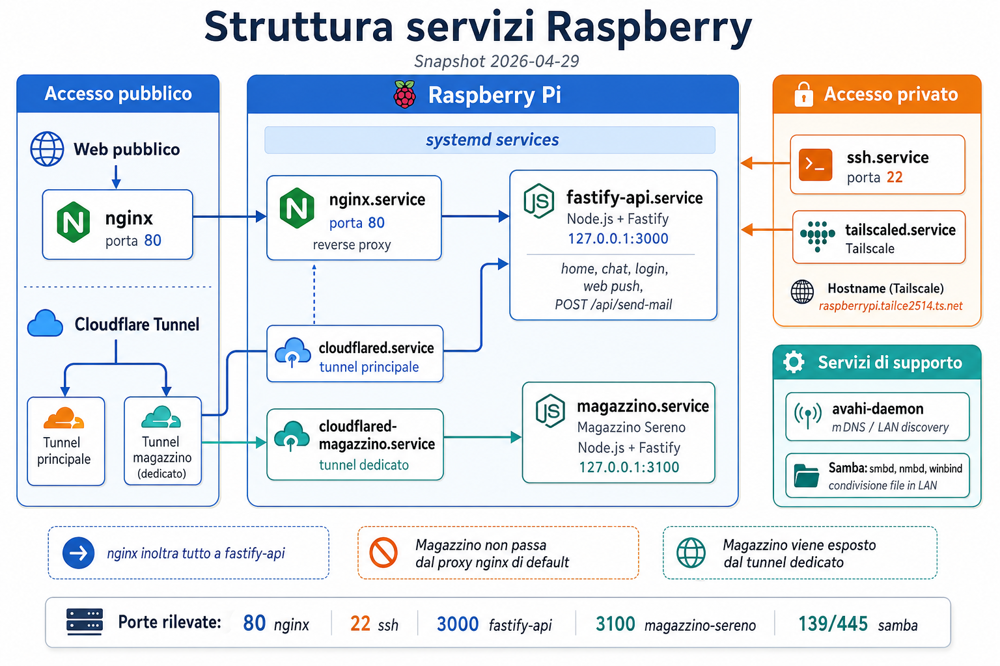

# Raspberry Services Inventory

Snapshot: 2026-04-29
Host: `raspberrypi`
Tailscale: `raspberrypi.tailce2514.ts.net`

Questo file documenta i servizi e le app che risultano in esecuzione sul Raspberry al momento del rilievo.



## Overview

Il Raspberry espone un web server `nginx` su porta `80` e usa servizi Node.js dietro proxy locale:

- `fastify-api` su `127.0.0.1:3000`
- `magazzino-sereno` su `127.0.0.1:3100`
- due tunnel `cloudflared`
- accesso remoto via `ssh` e `tailscaled`

## Running Services

### Web and reverse proxy

- `nginx.service`
  - ruolo: reverse proxy HTTP principale
  - porta pubblica: `80`
  - config attiva: `/etc/nginx/sites-available/fastify-api`
  - comportamento attuale: inoltra tutto a `http://127.0.0.1:3000`

Config rilevante:

```nginx
server {
    listen 80 default_server;
    listen [::]:80 default_server;
    server_name _;

    location / {
        client_max_body_size 20m;
        proxy_pass http://127.0.0.1:3000;
    }
}
```

### App 1: fastify-api

- service: `fastify-api.service`
- working dir: `/srv/apps/fastify-api`
- start command: `/usr/bin/node /srv/apps/fastify-api/server.js`
- bind: `127.0.0.1:3000`
- runtime: Node.js + Fastify

Dipendenze principali:

- `fastify`
- `@fastify/cors`
- `@fastify/multipart`
- `@fastify/websocket`
- `better-sqlite3`
- `nodemailer`
- `web-push`
- `ws`

Funzioni osservate:

- landing page e home applicativa
- route di stato: `/health`, `/status`
- chat
- registrazione/login utenti
- web push
- route mail: `POST /api/send-mail`

Note:

- gira come utente `giovanni`
- `NODE_ENV=production`
- `HOST=127.0.0.1`
- `PORT=3000`

### App 2: Magazzino Sereno

- service: `magazzino.service`
- working dir: `/home/giovanni/magazzino-sereno/server`
- start command: `/usr/bin/npm start`
- bind: `127.0.0.1:3100`
- runtime: Node.js + Fastify

Dipendenze principali:

- `fastify`
- `@fastify/multipart`
- `@fastify/static`
- `better-sqlite3`
- `marked`
- `xlsx`

Note:

- gira come utente `giovanni`
- `HOST=127.0.0.1`
- `PORT=3100`
- al momento non risulta dietro la config `nginx` attiva di default; probabilmente viene pubblicato tramite tunnel dedicato

### Cloudflare tunnels

- `cloudflared.service`
  - comando: `/usr/local/bin/cloudflared --no-autoupdate --config /etc/cloudflared/config.yml tunnel run`
  - ruolo: tunnel Cloudflare principale

- `cloudflared-magazzino.service`
  - comando: `/usr/local/bin/cloudflared tunnel --config /home/giovanni/.cloudflared/magazzino-config.yml run`
  - ruolo: tunnel dedicato per Magazzino

### Remote access and network

- `ssh.service`
  - porta: `22`
  - ruolo: accesso remoto shell

- `tailscaled.service`
  - ruolo: rete Tailscale / accesso privato

- `avahi-daemon.service`
  - ruolo: discovery LAN / mDNS

### File sharing and system support

- `smbd.service`
- `nmbd.service`
- `winbind.service`

Ruolo:

- stack Samba per condivisioni e interoperabilita di rete locale

## Listening Ports

Porte rilevate al momento del controllo:

- `0.0.0.0:80` -> `nginx`
- `0.0.0.0:22` -> `ssh`
- `127.0.0.1:3000` -> `fastify-api`
- `127.0.0.1:3100` -> `magazzino-sereno`
- `127.0.0.1:20242` -> `cloudflared`
- porte SMB (`139`, `445`)

## File and Paths

Percorsi principali:

- `fastify-api`: `/srv/apps/fastify-api`
- `magazzino-sereno`: `/home/giovanni/magazzino-sereno/server`
- `nginx active site`: `/etc/nginx/sites-available/fastify-api`
- `systemd unit fastify-api`: `/etc/systemd/system/fastify-api.service`
- `systemd unit magazzino`: `/etc/systemd/system/magazzino.service`
- `systemd unit cloudflared`: `/etc/systemd/system/cloudflared.service`
- `systemd unit cloudflared-magazzino`: `/etc/systemd/system/cloudflared-magazzino.service`

## Operational Notes

- `nginx` oggi punta tutto a `fastify-api`, quindi ogni app aggiuntiva pubblicata via HTTP richiede:
  - una nuova route/proxy dedicata
  - oppure un virtual host separato
  - oppure un tunnel Cloudflare dedicato

- La route contatti del sito Tongatron e stata ripristinata in `fastify-api` come:
  - `POST /api/send-mail`

- Il Raspberry ospita sia componenti di produzione sia utility personali/prototipi. Conviene tenere questo inventario aggiornato quando:
  - si aggiunge un nuovo service `systemd`
  - si cambia il target di `nginx`
  - si apre un nuovo tunnel Cloudflare

## Suggested Maintenance Commands

```bash
systemctl status fastify-api
systemctl status magazzino
systemctl status nginx
systemctl status cloudflared
systemctl status cloudflared-magazzino

ss -ltnp
journalctl -u fastify-api -n 100 --no-pager
journalctl -u magazzino -n 100 --no-pager
```
