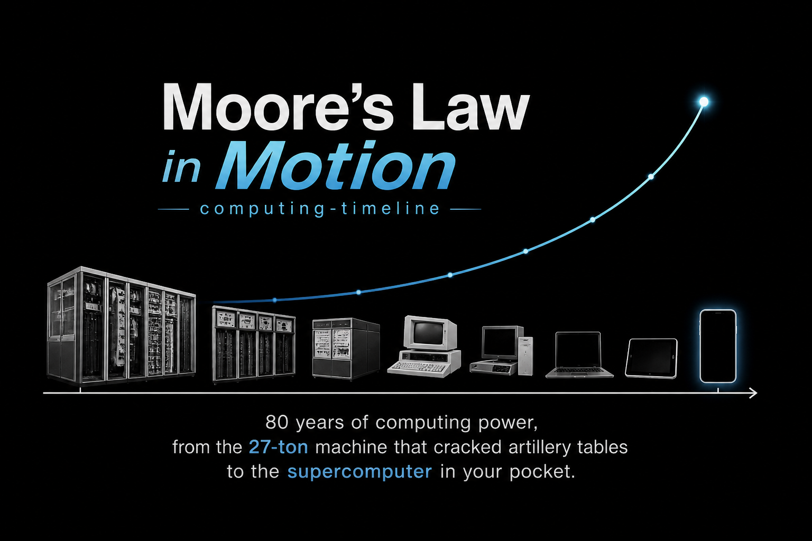

# Moore's Law in Motion

Interactive utility to visualise and compare 80 years of computing power — from the 27-ton ENIAC (1945) to today's pocket supercomputers.

🔗 **Live:** https://tongatron.org/projects/computing-timeline/

## Features

- **Sortable list** of iconic machines — by year, CPU speed (MIPS) or RAM
- **Multi-machine comparison** with a side-by-side modal showing specs, CPU/RAM bars and ratios vs the slowest/smallest
- **Growth-over-time charts** for CPU and RAM, with logarithmic / linear toggle
- **Workload calculator**: pick a workload (10⁶ → 10¹² operations, or custom) and see how long each selected machine would take — from nanoseconds to billions of years
- Single-file static page (no build, no dependencies)

## Mapped machines (37, chronological)

| Year | Machine |
|------|---------|
| 1945 | ENIAC |
| 1965 | PDP-8 |
| 1965 | IBM System/360 Model 30 |
| 1966 | Apollo Guidance Computer |
| 1975 | Altair 8800 |
| 1976 | Cray-1 |
| 1977 | Apple II |
| 1977 | Atari 2600 |
| 1981 | IBM PC (5150) |
| 1982 | Commodore 64 |
| 1982 | Sinclair ZX Spectrum |
| 1983 | Nintendo Entertainment System (NES) |
| 1984 | Apple Macintosh 128K |
| 1987 | Commodore Amiga 500 |
| 1989 | PC with Intel 80486 DX |
| 1989 | Nintendo Game Boy |
| 1990 | Super Nintendo (SNES) |
| 1994 | Sony PlayStation |
| 1995 | PC with Pentium |
| 1996 | Nintendo 64 |
| 1998 | iMac G3 |
| 2000 | Sony PlayStation 2 |
| 2003 | PC with Pentium 4 |
| 2005 | Xbox 360 |
| 2006 | Sony PlayStation 3 |
| 2007 | iPhone (1st gen) |
| 2008 | ATtiny85 |
| 2010 | Arduino UNO |
| 2015 | MacBook Pro (Intel Core i7) |
| 2016 | ESP32 |
| 2017 | Nintendo Switch |
| 2019 | Raspberry Pi 4 |
| 2020 | Sony PlayStation 5 |
| 2020 | Xbox Series X |
| 2022 | Steam Deck |
| 2023 | iPhone 15 Pro |
| 2024 | MacBook Pro M4 Max |

## How the workload calculator works

Time = `operations / (MIPS × 10⁶)` seconds.

MIPS values are indicative estimates. Comparing different architectures (8-bit AVR vs modern ARM/x86, vector supercomputers vs scalar CPUs) is never perfectly apples-to-apples — the goal is to convey the **scale** of change, not benchmark precision.

## Files

- `index.html` — the entire app (HTML + CSS + JS in one file)
- `logo.png` — logo and Open Graph preview image

## License

Part of [tongatron.org](https://tongatron.org/).
